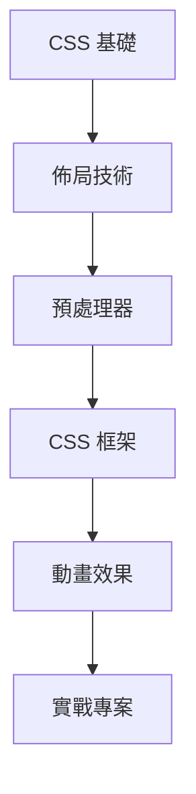

# 🎨 CSS 樣式技術

CSS（Cascading Style Sheets）是網頁樣式設計的核心技術，從基礎的選擇器到現代的預處理器和框架。

## 🎯 學習路徑

## 📚 技術分類

### 🔧 [CSS 基礎](./Basics/)
建立紮實的 CSS 基礎，掌握核心概念
- **選擇器**：元素、類別、ID、屬性選擇器
- **盒模型**：margin、border、padding、content
- **定位**：static、relative、absolute、fixed、sticky
- **顏色與字體**：色彩系統、字體設定、文字效果

### 📐 [佈局技術](./Layout/)
現代 CSS 佈局方案，打造響應式設計
- **Flexbox**：一維彈性佈局系統
- **Grid**：二維網格佈局系統
- **響應式設計**：媒體查詢、斷點設計
- **Container Queries**：容器查詢（未來趨勢）

### ⚙️ [SCSS 預處理器](./SCSS/)
更強大的 CSS 語法，提升開發效率
- **變數 Variables**：可重用的值
- **嵌套 Nesting**：更清晰的結構
- **混合 Mixins**：可重用的樣式片段
- **函式 Functions**：動態計算樣式值
- **模組化**：@import、@use、@forward

### 🚀 [Tailwind CSS](./Tailwind/)
實用優先的 CSS 框架，快速建立介面
- **實用類別**：atomic CSS 的威力
- **客製化設計**：色彩、間距、字體系統
- **響應式設計**：斷點前輟系統
- **元件提取**：@apply 指令使用
- **JIT 模式**：即時編譯優化

### 🎬 [動畫效果](./Animation/)
為網頁添加生動的互動體驗
- **CSS Transitions**：平滑過渡效果
- **CSS Animations**：關鍵幀動畫
- **Transform**：2D/3D 變換
- **性能優化**：GPU 加速、will-change 屬性

## 🛠️ 開發工具推薦

### 編輯器擴展
- **Auto Rename Tag**：自動重命名標籤
- **CSS Peek**：快速查看 CSS 定義
- **Prettier**：程式碼格式化
- **Live Sass Compiler**：即時編譯 SCSS

### 線上工具
- **Can I Use**：瀏覽器兼容性查詢
- **CSS Grid Generator**：視覺化網格生成器
- **Flexbox Froggy**：互動式 Flexbox 學習
- **Tailwind Play**：線上 Tailwind 編輯器

## 📈 學習進度追蹤

| 技術分類 | 學習狀態 | 重點掌握 | 實戰應用 |
|----------|----------|----------|----------|
| [CSS 基礎](./Basics/) | ✅ 已掌握 | 選擇器、盒模型 | ✅ 完成 |
| [佈局技術](./Layout/) | 🟢 進行中 | Flexbox、Grid | 🟢 練習中 |
| [SCSS](./SCSS/) | 🟡 學習中 | 變數、嵌套 | 🟡 待實作 |
| [Tailwind](./Tailwind/) | 🟡 學習中 | 實用類別 | 🟡 待實作 |
| [動畫效果](./Animation/) | 🔴 待開始 | - | 🔴 待開始 |

## 🎨 實戰專案建議

### 初級專案
- [ ] **個人名片**：HTML + CSS 基礎練習
- [ ] **響應式導航**：Flexbox + 媒體查詢
- [ ] **卡片設計**：Grid 佈局 + 過渡效果

### 中級專案
- [ ] **部落格佈局**：SCSS + BEM 方法論
- [ ] **電商產品頁**：Tailwind CSS 快速開發
- [ ] **儀表板介面**：複雜 Grid 佈局

### 進階專案
- [ ] **動畫作品集**：CSS 動畫 + JavaScript 互動
- [ ] **設計系統**：SCSS + CSS 自訂屬性
- [ ] **RWD 框架**：自製響應式框架

## 💡 學習心得與技巧

### 學習建議
1. **從基礎開始**：紮實的 CSS 基礎是一切的根本
2. **多做練習**：每個新概念都要實際操作
3. **觀察設計**：分析優秀網站的佈局和效果
4. **保持更新**：CSS 規範持續演進，要跟上趨勢

### 常見陷阱
- ❌ 過度依賴框架，忽視基礎
- ❌ 不理解盒模型導致的佈局問題
- ❌ 濫用 `!important` 導致樣式衝突
- ❌ 忽視瀏覽器兼容性

## 🔗 推薦資源

- 📚 **MDN CSS 文檔**：最權威的 CSS 參考資料
- 🎮 **CSS Battle**：CSS 解謎遊戲
- 📺 **Kevin Powell**：優質 CSS 教學 YouTube 頻道
- 🌟 **CodePen**：CSS 創意作品分享平台

---

*選擇一個分類開始你的 CSS 學習之旅吧！* 🚀