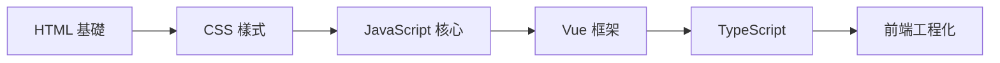

# 🎨 前端技術

現代前端開發的完整技術棧學習筆記，從基礎的 HTML、CSS、JavaScript 到進階的 Vue 和 TypeScript。

## 🎯 學習路徑

## 📚 技術分類

### 🌐 HTML - 網頁結構
- [語意化標籤](./HTML/semantic-html)：正確使用 HTML5 語意標籤
- [表單處理](./HTML/forms)：各種表單元件與驗證
- [無障礙設計](./HTML/accessibility)：打造友善的網頁體驗
- [SEO 優化](./HTML/seo)：提升搜尋引擎排名

### 🎨 CSS - 樣式設計
- [CSS 基礎](./CSS/basics)：選擇器、屬性、值
- [Flexbox 佈局](./CSS/flexbox)：現代彈性佈局方案
- [Grid 佈局](./CSS/grid)：二維網格系統
- [SCSS 預處理器](./CSS/scss)：更強大的 CSS 語法
- [Tailwind CSS](./CSS/tailwind)：實用優先的 CSS 框架
- [響應式設計](./CSS/responsive)：適配各種螢幕尺寸

### 📝 JavaScript - 互動邏輯
- [基礎語法](./JavaScript/basics)：變數、函式、控制流程
- [ES6+ 特性](./JavaScript/es6-plus)：現代 JavaScript 語法
- [陣列方法](./JavaScript/array-methods)：map、filter、reduce 等
- [物件導向](./JavaScript/oop)：類別、繼承、封裝
- [DOM 操作](./JavaScript/dom)：動態網頁交互
- [非同步處理](./JavaScript/async)：Promise、async/await

### 💚 Vue - 前端框架
- [Vue 基礎](./Vue/basics)：模板語法、指令、事件
- [元件系統](./Vue/components)：組件化開發思維
- [Composition API](./Vue/composition-api)：Vue 3 新特性
- [Vue Router](./Vue/router)：單頁應用路由
- [狀態管理](./Vue/state-management)：Pinia 狀態管理

### 🔷 TypeScript - 型別安全
- [基礎類型](./TypeScript/basics)：string、number、boolean 等
- [介面與類型](./TypeScript/interfaces)：自訂型別定義
- [泛型](./TypeScript/generics)：可重用的程式碼
- [Vue 與 TypeScript](./TypeScript/vue-with-ts)：在 Vue 中使用 TS

## 🔧 開發工具

- **編輯器**：VS Code + Vue 官方擴展
- **建構工具**：Vite（快速、現代）
- **版本控制**：Git + GitHub
- **瀏覽器開發工具**：Chrome DevTools

## 📈 學習進度

| 技術 | 進度 | 重點學習內容 |
|------|------|-------------|
| HTML | ✅ 已掌握 | 語意化、無障礙 |
| CSS | 🟢 進行中 | Grid、動畫效果 |
| JavaScript | 🟢 進行中 | ES6+、模組系統 |
| Vue | 🟢 進行中 | Composition API |
| TypeScript | 🟡 學習中 | 泛型、進階型別 |

## 💡 學習建議

1. **循序漸進**：從 HTML → CSS → JavaScript 的順序學習
2. **多做練習**：每個概念都要親自實作
3. **專案導向**：透過實際專案來應用知識
4. **持續更新**：前端技術更新快，要保持學習

## 🚀 實戰專案

- [ ] **響應式網頁**：HTML + CSS 練習
- [ ] **待辦清單**：JavaScript DOM 操作
- [ ] **Vue 元件庫**：組件化開發實踐
- [ ] **全端部落格**：Vue + TypeScript 綜合應用

---

*開始你的前端學習之旅！每一個小步驟都是進步 🎯*